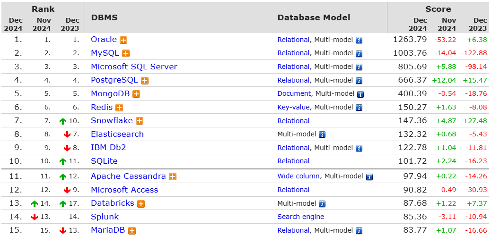
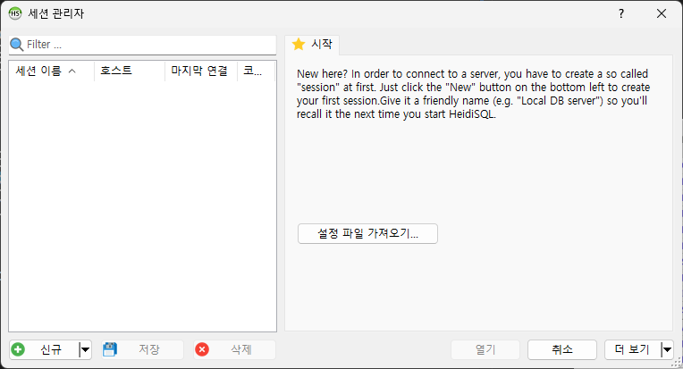
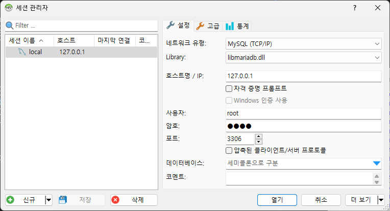

# DataBaseStudy

+ [MariaDB](https://mariadb.org/)
+ [Documentation](https://mariadb.org/documentation/)
+ [HeidiSQL](https://www.heidisql.com/download.php#google_vignette)
+ [Docker Image](https://hub.docker.com/_/mariadb)

## DB와 DBMS
1. Database (DB)
+ 논리적으로 연관된 데이터를 모아 일정한 형태로 저장하는 곳
+ 응용 시스템들이 공용(Shared)으로 사용하기 위하여 통합(Integrated), 저장(Stored)한 데이터 집합
+ [위키백과 링크](https://ko.wikipedia.org/wiki/%EB%8D%B0%EC%9D%B4%ED%84%B0%EB%B2%A0%EC%9D%B4%EC%8A%A4)

2. Database Management System (DBMS)
+ 데이터베이스 관리 프로그램
+ DBMS를 이용하여 데이터 입력(Insert), 수정(Update), 삭제(Delete) 등의 기능을 제공
+ [위키백과 링크](https://ko.wikipedia.org/wiki/%EB%8D%B0%EC%9D%B4%ED%84%B0%EB%B2%A0%EC%9D%B4%EC%8A%A4_%EA%B4%80%EB%A6%AC_%EC%8B%9C%EC%8A%A4%ED%85%9C)

3. Relational Database (RDB)
+ 데이터를 열과 행으로 구성하여 테이블로 관리
+ 고유키는 각 행을 식별 (기본키, PK)
+ 데이터는 행 단위로 저장되며, 각 항목의 속성은 열로 표현한다
+ 테이블간의 관계를 이용하여 데이터를 이용한다.
+ [위키백과 링크](https://ko.wikipedia.org/wiki/%EA%B4%80%EA%B3%84%ED%98%95_%EB%8D%B0%EC%9D%B4%ED%84%B0%EB%B2%A0%EC%9D%B4%EC%8A%A4)

4. 관계형 데이터베이스 종류
+ [Oracle](https://www.oracle.com/kr/)
+ [MS SQL Server](https://www.microsoft.com/ko-kr/sql-server)
+ [IBM DB2](https://www.ibm.com/kr-ko/db2)
+ [Sybase](https://www.sap.com/korea/products/acquired-brands/what-is-sybase.html)
+ [MySQL](https://www.mysql.com/)
+ [MariaDB](https://mariadb.org/)

</img>

## HeidiSQL 알아보기
1. HeidiSQL를 이용하여 접속하기 
+ HeidiSQL 실행 후  `신규` 버튼 클릭
</img>

2. MariaDB 접속 정보 입력 후 `저장` 버튼 클릭
</img>

3. `열기` 버튼 클릭하여 접속

## MariaDB 알아보기
